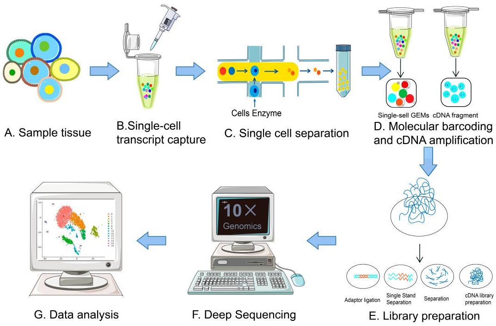

# *Profiling 10X Single-Cell RNA analysis pipeline*

## *Compiled by Desmond Akabetso Nde*

## *Udated on the 01st of Ocober 2024*

## Table of content

 Introduction
 preparation
 preprocessing
 clustering and comparison

## Introduction

From the perspectives of Shuo [Wand wr al,](https://www.ncbi.nlm.nih.gov/pmc/articles/PMC9918030/) Single-cell RNA sequencing (scRNA-Seq) has become a powerful tool for describing cell subpopulation classification and cell heterogeneity by achieving high-throughput and multidimensional analysis of individual cells and circumventing the shortcomings of traditional sequencing for detecting the average transcript level of cell populations. The cellular resolution and genome wide scope make it possible to draw new conclusions that are not otherwise possible with bulk RNA-seq. The analysis requires a great deal of knowledge about statistics, wet-lab protocols, and some machine learning due to variability and sparseness of the data. The uncertainty from the low coverage and low cell numbers per sample that once were common setbacks in the field are overcome by 10x Genomics which provides high-throughput solutions which are quickly championing the field.

Looking back into the uncertaintity from low coverage and low cell numbers per sample in scRNA-seq pipelines, 10X Genomics have emerged providing not only a cost-effective high-throughput solution to understanding sample heterogeneity at the cellular level, but also has defined standards of the field in downstream analysis. It has achieved a gain in resolution reducing the granularity and noise issues that pertubated downstream analysis not long ago.

#### Library preparation

Among various scRNA-Seq methods, the 10× Genomics platform has become popular due to its high throughput and cost-effectiveness. Developed using microfluidic droplet technology, it enables cDNA library preparation for subsequent sequencing. Studies have shown its effectiveness in analyzing cell heterogeneity, such as distinguishing immune cell populations and revealing differences in cell subsets between healthy individuals and those with acute myeloid leukemia (AML).

The 10X technology relies on the 10X barcoded gel beads which consist of a pool of barcodes which are used to separately index each cell’s transcriptome. The individual gel barcodes are delivered to each cell via flow-cytometry, where each cell is fed single-file along a liquid tube and tagged with a 10X gel bead. The cells are then isolated from one another within thousands of nanoliter droplets, where each droplet described by a unique 10x barcode that all reads in that droplet are associated with once they undergo reverse-transcription (RT) which reconstructs the mRNA into a cDNA counterpart. The oil is then removed and all (now barcoded) cDNA reads are pooled together to be sequenced.
Though there are approximately 3 million 10x gel barcodes used, the amount actually qualitatively profiled in a sample is ~10,000 due to majority of droplets (>90%) being empty in order to ensure that the remainder contains only one cell.

**Figure 1:** (A) Collect cells from tissue samples. (B) Single-cell capture process. (C) Cell isolation process. (D) Reverse transcription of mRNA and amplification of cDNA. (E) scRNA-Seq Library construction. (F) Deep sequencing with 10X Whitelist and (G) Data analysis

Single-cell separation is crucial in scRNA-Seq, traditionally achieved through methods like serial dilution and fluorescence-activated cell sorting (FACS). Recent advancements include magnetically activated cell sorting (MACS) and microfluidics, which are preferred for their efficiency and precision. Microfluidics operates on a micron-sized chip and is categorized into integrated fluidic circuits (IFCs), microporous methods, and droplet methods.

Constructing a cDNA library is central to scRNA-Seq, with PCR-based amplification being the predominant method. Techniques include end-tailing (fast but error-prone), template-switching (reduces nucleic acid loss but has lower sensitivity), in vitro transcription (IVT, less efficient), and Phi29 polymerase replication (efficient for longer sequences but may miss low-abundance mRNAs). Unique molecular identifiers (UMIs) are used to improve quantification accuracy.

Data analysis involves several steps: alignment of sequencing fragments, quality control (QC), quantification, normalization, batch correction, and dimensionality reduction, followed by downstream analyses to reveal functional insights into cell subpopulations.

### Materials and method

### Materials

#### Dataset

10X Genomics provided a 1K PBMCs from a healthy donor (v3 chemistry) which consist of 1000 peripheral blood mononuclear cells extracted from healthy donor. The [Zenodo](https://zenodo.org/records/3457880) linke of the source file provided in Galaxy contained 6 FASTQ files sequenced in two lanes each contain a forward and reverse read. The forward reads contains the barcodes with UMIs embeded into each and the reverse read contains the cDNA sequences.

To proceed with downstream analysis, we need to understand the chemistry version used in the 10X Genomics pipeline. While STARsolo can can detect version used, it it important to describe the barcode length used in during demultiplexing based on the chemistry verions used in devoloping the dataset.

**Table 1:** 10X chemistry sequence informatino
| Chemistry | Read 2 | Read 1 (CB + UMI)  | Insert (Read 2 + Read 1) |
|-----------|--------|--------------------|--------------------------|
| v2        | 98     | 26 (16 + 10)       | 124                      |
| v3        | 91     | 28 (16 + 12)       | 119                      |

### Method

#### Pre-processing of Single-Cell RNA Data

Cell Ranger is the ininitial pipeline for processing 10x Genomics outputs, this process is known to be complex and computationally expensive. to subconvent this, STARsolo has proven to be a drop-in solution to the Cell Ranger pipeline to demultiplex and allign 10X Genomics output and produce a counts matrix ready for post pre-processing.

### Results

### Conclusion
