# *Profiling 10X Single-Cell RNA analysis pipeline*

## *Compiled by Desmond Akabetso Nde*

## *Udated on the 01st of Ocober 2024*

## Workflow

 - Introduction
 - preparation
 - preprocessing
 - Producing a count Matrix from FASTQ
 - Producing a Quality count matrix
 - Qualitty control
 - Dimensional reduction
 - Clustering of the cells
 - Finding marker genes
 - Cell type annotaion
 - Conclusion

## Introduction

From the perspectives of Shuo [Wang S. al,](https://www.ncbi.nlm.nih.gov/pmc/articles/PMC9918030/) Single-cell RNA sequencing (scRNA-Seq) has become a powerful tool for describing cell subpopulation classification and cell heterogeneity by achieving high-throughput and multidimensional analysis of individual cells and circumventing the shortcomings of traditional sequencing for detecting the average transcript level of cell populations. The cellular resolution and genome wide scope make it possible to draw new conclusions that are not otherwise possible with bulk RNA-seq. The analysis requires a great deal of knowledge about statistics, wet-lab protocols, and some machine learning due to variability and sparseness of the data. The uncertainty from the low coverage and low cell numbers per sample that once were common setbacks in the field are overcome by 10x Genomics which provides high-throughput solutions which are quickly championing the field.

Looking back into the uncertaintity from low coverage and low cell numbers per sample in scRNA-seq pipelines, 10X Genomics have emerged providing not only a cost-effective high-throughput solution to understanding sample heterogeneity at the cellular level, but also has defined standards of the field in downstream analysis. It has achieved a gain in resolution reducing the granularity and noise issues that pertubated downstream analysis not long ago.

#### Library preparation

Among various scRNA-Seq methods, the 10× Genomics platform has become popular due to its high throughput and cost-effectiveness. Developed using microfluidic droplet technology, it enables cDNA library preparation for subsequent sequencing. Studies have shown its effectiveness in analyzing cell heterogeneity, such as distinguishing immune cell populations and revealing differences in cell subsets between healthy individuals and those with acute myeloid leukemia (AML).

The 10X technology relies on the 10X barcoded gel beads which consist of a pool of barcodes which are used to separately index each cell’s transcriptome. The individual gel barcodes are delivered to each cell via flow-cytometry, where each cell is fed single-file along a liquid tube and tagged with a 10X gel bead. The cells are then isolated from one another within thousands of nanoliter droplets, where each droplet described by a unique 10x barcode that all reads in that droplet are associated with once they undergo reverse-transcription (RT) which reconstructs the mRNA into a cDNA counterpart. The oil is then removed and all (now barcoded) cDNA reads are pooled together to be sequenced.
Though there are approximately 3 million 10x gel barcodes used, the amount actually qualitatively profiled in a sample is ~10,000 due to majority of droplets (>90%) being empty in order to ensure that the remainder contains only one cell.

**Figure 1:** (A) Collect cells from tissue samples. (B) Single-cell capture process. (C) Cell isolation process. (D) Reverse transcription of mRNA and amplification of cDNA. (E) scRNA-Seq Library construction. (F) Deep sequencing with 10X Whitelist and (G) Data analysis. printed from [Wang S. et al](https://www.ncbi.nlm.nih.gov/pmc/articles/PMC9918030/)

Single-cell separation is crucial in scRNA-Seq, traditionally achieved through methods like serial dilution and fluorescence-activated cell sorting (FACS). Recent advancements include magnetically activated cell sorting (MACS) and microfluidics, which are preferred for their efficiency and precision. Microfluidics operates on a micron-sized chip and is categorized into integrated fluidic circuits (IFCs), microporous methods, and droplet methods.

Constructing a cDNA library is central to scRNA-Seq, with PCR-based amplification being the predominant method. Techniques include end-tailing (fast but error-prone), template-switching (reduces nucleic acid loss but has lower sensitivity), in vitro transcription (IVT, less efficient), and Phi29 polymerase replication (efficient for longer sequences but may miss low-abundance mRNAs). Unique molecular identifiers (UMIs) are used to improve quantification accuracy.

Data analysis involves several steps: alignment of sequencing fragments, quality control (QC), quantification, normalization, batch correction, and dimensionality reduction, followed by downstream analyses to reveal functional insights into cell subpopulations.

### Materials and method

### Materials

#### Dataset

[10X Genomics](https://www.10xgenomics.com/platforms/xenium?utm_medium=search&utm_source=google&utm_content=website-page&utm_campaign=7011P000001Pw8ZQAS&gad_source=1) provided a 1K PBMCs from a healthy donor (v3 chemistry) which consist of 1000 peripheral blood mononuclear cells extracted from healthy donor. The [Zenodo](https://zenodo.org/records/3457880) link of the source file provided in Galaxy contained 6 FASTQ files sequenced in two lanes each contain a forward and reverse read. The forward reads contains the barcodes with UMIs embeded into each and the reverse read contains the cDNA sequences.

To proceed with downstream analysis, we need to understand the chemistry version used in the 10X Genomics pipeline. While STARsolo can can detect version used, it it important to describe the barcode length used in during demultiplexing based on the chemistry verions used in devoloping the dataset.

**Table 1:** 10X chemistry sequence informatino
| Chemistry | Read 2 | Read 1 (CB + UMI)  | Insert (Read 2 + Read 1) |
|-----------|--------|--------------------|--------------------------|
| v2        | 98     | 26 (16 + 10)       | 124                      |
| v3        | 91     | 28 (16 + 12)       | 119                      |

[Ensemble](https://www.ensembl.org/Homo_sapiens/Info/Index) for downloading the fasta file of reference genome ([Genome assembly: GRCh38.p14 (GCA_000001405.29)](https://ftp.ensembl.org/pub/release-112/fasta/homo_sapiens/dna/)) and the genome annotation file ([GRCh38.112](https://ftp.ensembl.org/pub/release-112/gtf/homo_sapiens/))

#### Tools

[STAR](https://github.com/alexdobin/STAR)

[STARsolo](https://github.com/alexdobin/STAR/blob/master/docs/STARsolo.md) downloadable from [GitHub](https://github.com/alexdobin/STAR/releases)

[DropletUtils](https://bioconductor.org/packages/release/bioc/html/DropletUtils.html) downladable with the BiocManager package [(BiocManager::install("DropletUtils"))](https://bioconductor.org/packages/release/bioc/html/DropletUtils.html)

[MultiQC](https://multiqc.info/) downloaded via [pip or conda install multiqc](https://docs.seqera.io/multiqc/getting_started/installation)

[Scanpy](https://scanpy.readthedocs.io/en/stable/tutorials/index.html) [downloadable](https://scanpy.readthedocs.io/en/stable/installation.html) via pip or conda install.

### Method

#### Pre-processing of Single-Cell RNA Data

Cell Ranger is the ininitial pipeline for processing 10x Genomics outputs, this process is known to be complex and computationally expensive. to subconvent this, [STARsolo](https://github.com/alexdobin/STAR/blob/master/docs/STARsolo.md) has proven to be a drop-in solution to the Cell Ranger pipeline to demultiplex and allign 10X Genomics output and produce a counts matrix ready for post pre-processing.

**Indexing the reference genome:** By Indexing the reads with STAR, it creates a compacted genome to git into the memory during aligment, STAR quicly find the best alignment positions for each read reducing search space and improving speed. The introduction od GTF file during indexing also accounts for known splice junctions during alignment, which is particularly important when reads span exon-exon junctions. 

**Demultiplexing and Quantification:** The STARsolo parse the parameters for demultiplexing, mapping and quantifying both sets of reads using chemistry version 3 as contained in the dataset. I had previously indexed the whole human genome making it easier to load in the memory. In this process STARsolo requires the 10X Genomics barcodes Whitelist to perform the demultiplexing assigning each reads to it's respective sample. The files are loaded respecting the other describes in the documentation of STARsolo with filtering option deactivated as we will muanually deactivate them downstream for more controlability. At the end of this process, a 5 files are generated including a log file, mapping quality file, and 3 counts matrix files. The bam allignment files were turned off.

**Quality Control with MultiQC**  was then used to assess these files and generate a nice quality report describing the quality of the data.

**Producing a Quality Count Matrix:** STARsolo produced a bundled matrix format seperating genes vs cells information in seperate files. At this stage, the number of cells are over-represented as they have not yet been filtered for high quality cells. So, we use DropletUtils to produce a filtered dataset that is more representative of the Cell Ranger pipeline. The STARsolo bundle matrix is inserted in the DropletUtils pipeline defining the number of cells expected in our sample (3000) with an upper quantile of 0.99 which is the threshold for retaining high confidence cell barcodes by foccussing on barcodes that are in the 99th percentile of UMI counts. This helps to elude the majority of background noise or empty droplets with low counts. We later ploted the barcode rank plot whigh shows the log of total UMI count and their ranks. 

**Quality control with Scanpy:** The first upstream analysis of Scanpy is to observe the cell size (the total sum of counts accross all genes for each cells), the number of reads mapped to gene in the mitochondrial genome and the number of expressed genes (number of genes with non-zero counts for each cells). Low quality cells may be due do a variety of causes ranging from cell damage during dissociation to failure in library preparation. Usually they may have low total counts, few expressed genes and high mitochodrial or spike-in proportions. We create a new column and assign True or False for each genes mapped to mitochondrial gene or not respectively. We then create a violin and a sctter plot accross the data mentioned here.

**Filtering of low-quality cells** I now proceed to filter for low-quality cells based on the 3 previous metrics generated above (cell size, number of expressed genes and the proportions of genes mapped to mitochondrial genes). I cut-off genes less than 200 and above 2500 as descrived in the Violin plot. I equally cut-off percentage of reads mapped to mitochondrial genes above 5%.

**Normalization and scaling** Generally in scRNA-Seq, cells may show variations in the number of reads or coverage not because of biological differences but due to technical issues like cDNA capture whcih varies between cells and PCR amplification efficiency which varies equally accross cells. After removing low quality cells, normalization of the counts removes theses differences to avoid that they  interfere with comparisons of the expression profiles between cells.

Scalling normalization is the simplest and most commonly used class of normalization strategies, each cell counts is divided by a cell specific scaling factor (size factor). The assumption is that any technical biases tend to affect genes in a similar manner. While each cell may have a relative biases represented by the size factor for that cell. Dividing the cell counts by its size factor should then remove the bias. scale normalization is transformed such that the size factor accross all cells is equal to 1. The normalized expression are then kept on the scale as the original counts. Here we normalize such that each cell have 10000 reads and creare a new column called norm to contain the normalization.

**Selection of features** Selecting the most variable genes based on their expression accross the cells (genes highly expressed in one cell and low in other) is the simplest approach for featur selection. We asume that the variation in some genes compared to other genes are genuine biological differences and not technical noise. With clustering and dimensionality reduction, cells are compared based on their gene expression profiles. 

The simplest approach to quantify per gene variation is computing the variance of the log-normalized expression values for each gene accross all cells. So we quantified the per gene variation and selected the subset of highly variable genes that we will used downstream analysis to ensure that the quantitative heterogeneity is consistent through-out the anlysis. The seurat method is efficient for computing gene variability, we used a minimum threshold between variable and non variable genes and a normalized dispsersion cutt-off to set a lower limit on the normalized dispersion. only genes with dispersion above this threshold are retiained because the show sufficient variability across cells.

**Scaling the data** We need to apply a linear transformation or scaling before demensional reduction. This is done by regressing out the unwanted sources of variation in the todal counts per cell and the percentage of mitochondrial genes expressed. In order to give equal wight in downstream analysis and ensure that highly-expressed genes do not dominate, we ensure the variance accross cells is 1 and the mean expression is 0.

**Dimension reduction and PCA:** Here we aim to identify similar transcriptomic profiles, with each gene represnts a dimension of the data. We make a 2-dimensional plot where each point is cell and each axis is the expression of one gene. PCA is a nice dimensional reduction technique consisting in the identification of axis in high dimensional space that captue the larges amound of variation. We plot PCA with 50 PCs (50 PCs represents a robust compression of the dataset)

**Clustering Cells** Firstly, we determine the number of PCs (dataset compression). A simple method for choosing the number of PCs is to generate an elbow plot ranking the PCs based on the percentage of variance permiting to choose PCs that follow a more linear curve. We proceed in defining the cell population observed int he PCA plot. To do this, we firtst compute the neigborhood graph (to determine neigborhood with similar expression pattern with higher weigths to cells that are similarly related) and then clustering at the end.

**Finding marker genes:** Here we thrive to find genes that drive the seperation between clusters which can then be used to give sense or meaning to the cell populations.  Marker genes are usually detected by their differential expression between clusters, more strong Differential genes might have droven seperate clustering of cells. We used t-test and the wilcoxon statistical test to rank marker genes. We equally used the louvain algoritm to cluster cells, so the statistical test will rank genes that differentiate this clusters. For each group, we return 100 genes ranked by how well they characterize the cluster compared to other clusters. And finally, we applied the Benjamini-Hochberg correction method to adjust the p-value and control false discovery rate.

And the last step was visualizing the expression of the marker genes and annotating the cell sub-populations.

### Results

**QC metrics:** We began by examining the distributions of the 3 QC metrics. According to figure 2, for the cell size (total counts), most of the values are between 1000 and 4000 reads. The number of expressed genes (n_genes_by_counts) are mostly between 500 and 1200 genes. for both we have a few cells with high value distribitions. The distribution of the proportions of reads mapped to mitochondrial genes (pct_counts_mt) is even more narrower, not all reads have been mapped to mitochondrial genes. Most cells mapped to mitochondrial reads fall within a small range between 0 and 5%. A few cells show higher percentage, Mitonchondrial genes represent a small fraction of the transcriptome in healthy cells so, when the fraction is higher, it might be sressed or death cells being expressed or noise.

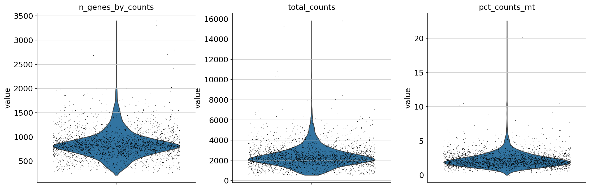

Figure2: QC metrics

According to figure 3 (righ), there's a strong correlation between the cell size and the number of genes expressed which is importand to understand the quality and consistency of our dataset. cells with more reads tend to have more genes expressed (more reads means more genes can be identified) but if a cell has more reads and lesser genes it might call for attention of poor cell quality or technical issues. Figure 3 (left) shows that, cells with higher propertion mitochondrial genes are not cells with many expressed genes. higher percentage > 5% have fewer genes for exemple. 5% turns to be a good threshold to cut of genes with low counts. Also, low expressed genes may show low quality cells, so in our casse we see we have almost no expression below 200, so we can eliminate this cells and alos cells above 2500 equally.

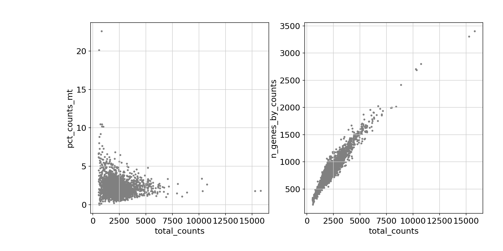
Figure 3. Observing QC metrics with scatter plot

**Highly variable genes** It's is important to detect highly variable genes (HGV) as they are useful for downstream analysis. HVG are key drivers of biological diversity, they help distinguish between different cell types or states. 

Figure 4 (left) shos that after normalization, there is less variability in gene dispersion accross celss for the less variable genes while highly variable genes are more clearly seperated. overall, the normalization shows that the technical variations have been reduced and biological signal is more prominent while for figure 4 (rigth), the plot hasn't be normalized and dispersion are higher and more scattered, especially for genes with low mean expression. there seems to be more noise which may mask biological insight. many genes aprearing to be variable may not be because they might be driven by noise.

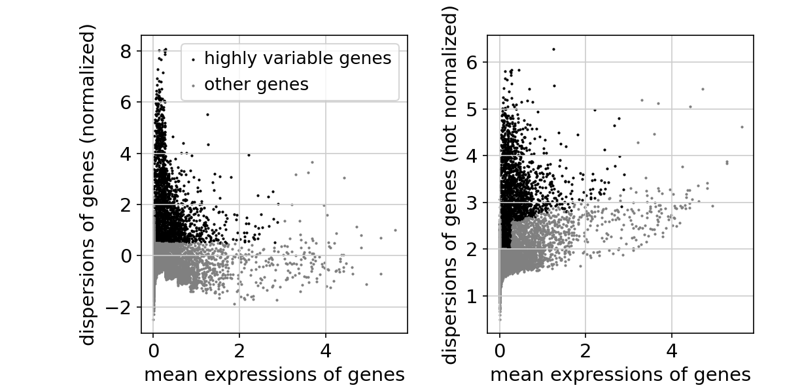

Figure 4: Highly variable genes.

**Dimensionality reduction** Here we use PCA capture the largest amount of variation. In PCA, the first axis or PC captures the greates variance accross cells and the nect PC should be orthogonal to the first and capture the greatest left over variation. Figure 5 uses 3 PC to capture all variation (PC1 vs PC2 and PC2 vs PC3) using one of the highly ranked marger genes CST3. We can as well project the PCs for other genes ot observe their variations. For CST3, the differences are mostly projected on PC1 because SCT3 is the top gene for PC1 but not visible on the PC2 vs PC3.

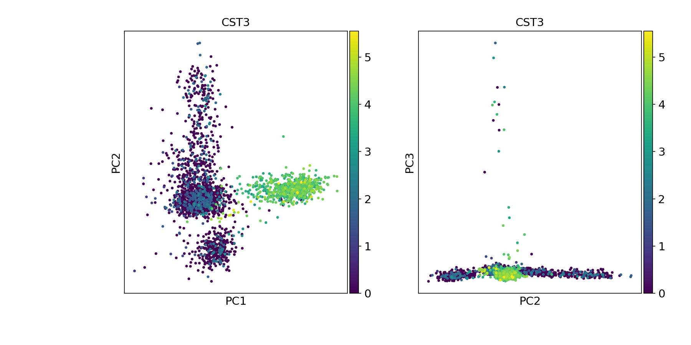
Figure 5: PCA plot

**Clustering** Before proceeding to clustering, It's important to consider the number of PCs to keep. more PCs means more noise but also more biological signal. According to our elbow plot (not represented here but fount in the [results directory](https://github.com/akabetso/Reproducing_10X_scRNA_Workflow_From_Galaxy/blob/master/results/scanpy/pca_variance_ratioelbow_plot.png)) a PC of 10 presents a just selection to limit noise but have more biological variations.

So after calculating the neighborhood and aplying the louvain algorithm, we identified 8 clusters, CST3 is highly variable in cluster 1, 4, 6 and 7. while NkG7 is more highly in 3 and 6 as well as PPBP highly variable in 7.

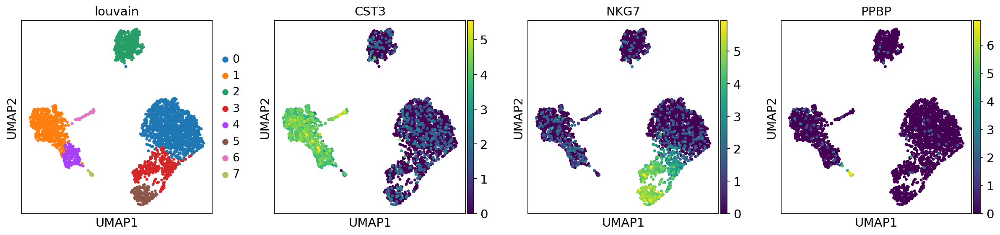

Figure 6: UMAP1 clustering.

**Gene markers** Here, the main goal is to identify the genes that drives seperation between clusters. We use them to identify each cluster based on their functional annotation. t-test and the wilcoxon statistical methods provides the differential expression of the marker genes between the clusters. The 20 top ranked gene per cluster are presented. We present in figure 7&8 the snipset of the top 5 genes per cluster for both t-test and the wilcoxon sum-test to compare the effiency of the marker genes ranked or selected.

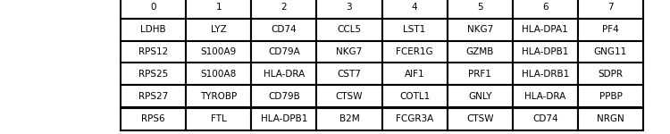

Figure 7&8: t-test and wilcoxon top 5 ranked marker genes

According tho the t-test statistical differentiator, CST3 is the marker gene for cluster 1, 4 and 6 while NKG& for cluster 3 and 5 as well as PPBP for cluster 7 all as accurate as prevously guessed. For Wilcoxon statistics the same pattern for marker genes are main as defined by t-test method. some genes happen to permuted in rank but the top marker genes remain unchanged. 

**Comparing Differentially differerntial genes of Interest:** Galaxy has chosen the genes descriped in the clustering plot as genes of interest. we examine their differential expression accross the clusters. Figure 9 shows that CST3 is more expressed in cluster 1, 4 and 6 while NKG7 is highly expressed in the 3 and 5 while the PPBP is highly expressed in cluster 7. this only confirms the statistics method we've seen right from clustering. 

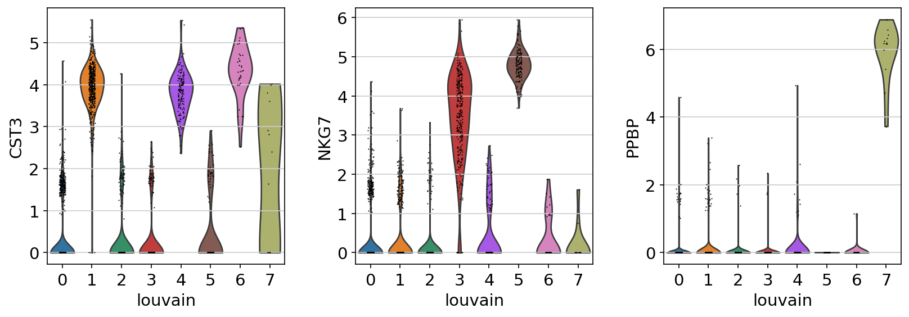

Figure 9: Marker gene expression level accross clusters

Further, we can plot the expression probability distributions accross cluster for the top markers (figure 10). Figure 9 shows that LDHB, LYZ and CD74 while they are top marker genes for cluster 0, 1 and 2 respectively, are also expressed in all other clusters (and also found in the top marker genes for other clusters), but conatin higher levels in the clusters as they are markers. CCL5, LST1 NKG7 and HLA-DPA1 are not expressed in all clusters but also not only in the one they are markers there. PF4 is only expressed in cluster 7.

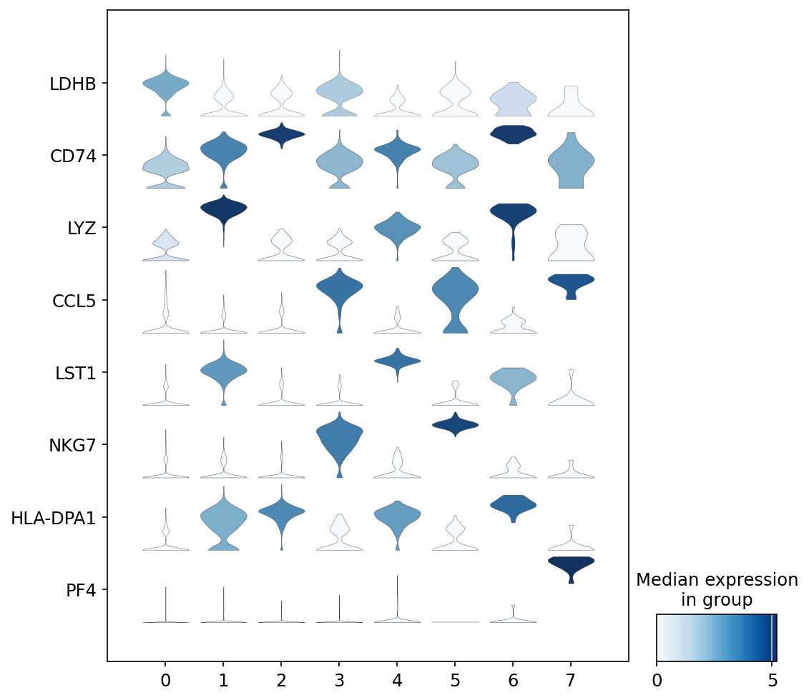

Figure 10: Marker gene expression probability distribution accross clusters.

Furthermore, we can use the UMAP to deepen the expression level of the marker gene expressed in the probability distribution plot (Figure 11). For most genes, we can clearly see for which cluster they are marker genes, though the differences may not be too obvious for physically clossed clusters.

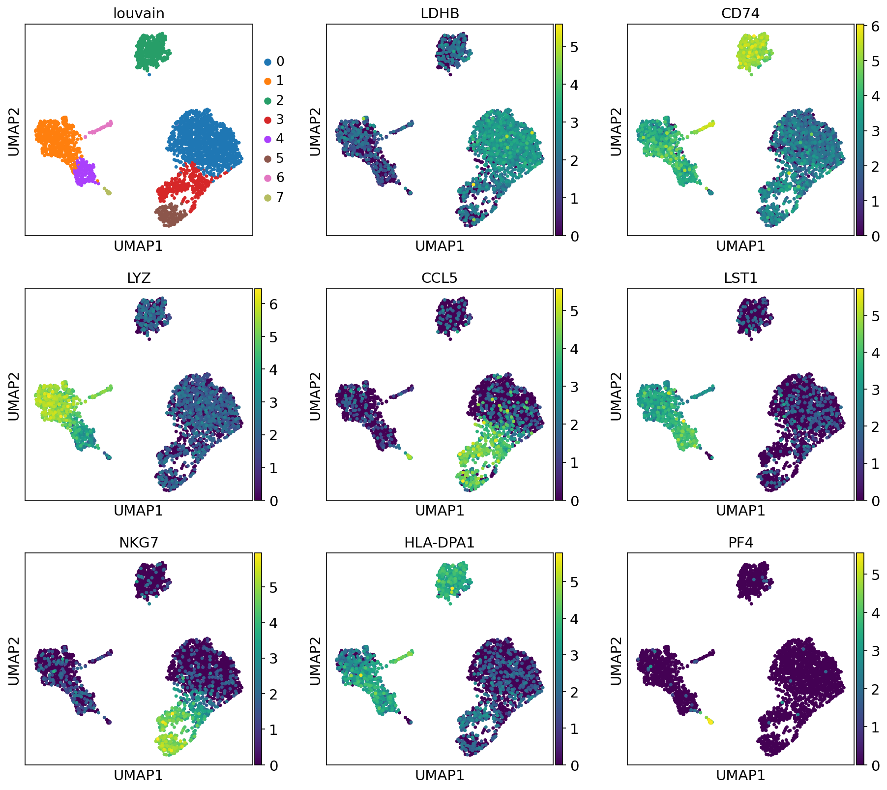

Figure 11: UMAP1 expression for marker genes.

We have been looking at the top 5 marker genes. to show that it is possible to have a look at the expression of the top 20 marker genes in the different cells for each cluster, heatmap is ideal to show the simalirities between the expression and clustering (Figure 12). We see that cluster 0, 3 and 5 are simular in terms of expression, this is to be expected as they are physically close on the neighborhood graph. Cluster 1 and 4 are toghether and the 2 and 5 are together after 7. these ovservations are ecprected following the similarity on the neighnorhood graph ploted earlier.

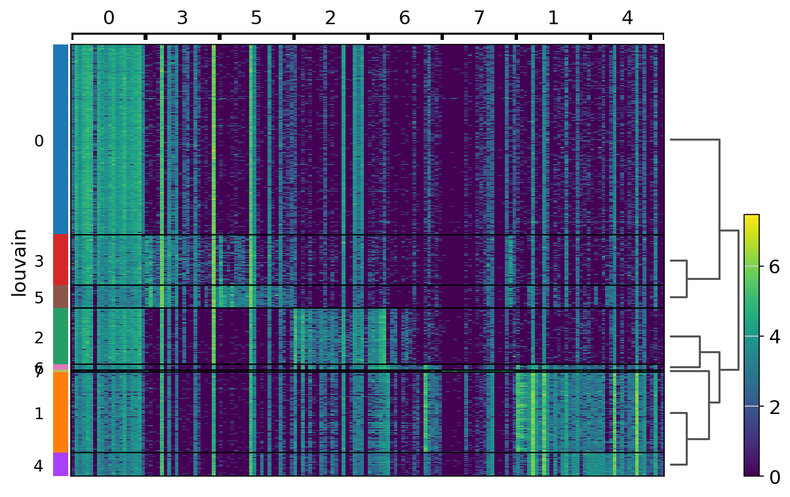

Figure 12: Heatmap plot for cluster and expression similarities.

**Cell annotation** Following consistency in clustering and expression of gene, It is now ideal to visualize the clustering based on it's annotation or cell type. We created a correspondance between the gene markers and the biological knowledge describing these gene markers. For exemple CD$+ T cells represents IL7R or CCR7, relating this information to the clusters defined by this markers. From Figure 13, we see that CD4+ and CD8+ T cells are clustered together with NK cells. Monocytes cells CD14+ and FCGR3A+ are equally close together with Dendritic and megakaryocytes while B cells are independent. 

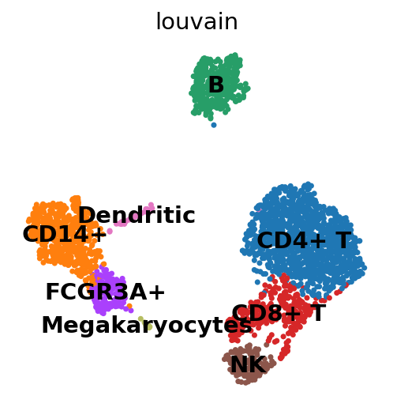

Figure 13: Cell population annotation.

**Conclusion:** This only represents simillarities between these cell populations in a healthly individual and may tell more about how they are recruited or dissimilar in different situations or when affected by a pathogen. Their differention or variation may tell which genes are affected and consequently which cells are are affected by the pathogen. In cancer for exemple, might tell which cell subpopulations appear in the system.

In this work, the main aim was to reproduce the scRNA-Seq from galaxy in linux environment. It was quite challenging but a perfect method for learning as it pushed me to read thourh the documentation of each tool to know which syntex to use and why am I using it. We preprocessed the dataset from creating index to mapping and filtering. While analyzing wigh scanpy for clustering, I checked the quality control and filter accordingly and proceed with dimendional reduction, normalization and scaling, feature selectionb, clustering wigh neighborhood, identificaiton of marker genes and annotation.

Thank your for reading throudh, I will greatly appreciate your feedback and any further insights. 